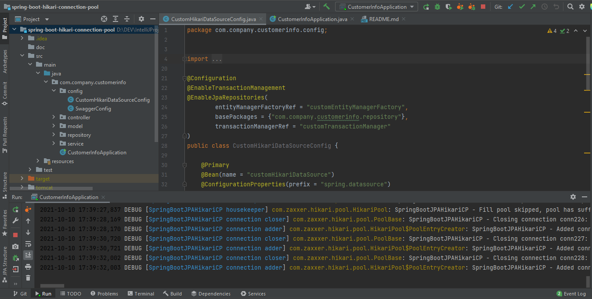

## spring-boot-hikari-connection-pool

Purpose : Use hikari connection pool for db connection object re-use and caching.  
Reason : Improve application run-time performance.   

### Local run steps  
1- Start Spring Boot API by running main method containing class CustomerInfoApplication.java in your IDE.  
2- Alternatively you can start your Docker container by following the commands below.  
NOT : Execute maven command from where the pom.xml is located in the project directory to create Spring Boot executable jar.  
<pre> 
$ mvn clean install -U -X  
</pre>

2021-10-12 23:12:25,670 DEBUG [main] com.zaxxer.hikari.HikariConfig: SpringBootJPAHikariCP - configuration:  
2021-10-12 23:12:25,699 DEBUG [main] com.zaxxer.hikari.HikariConfig: connectionInitSql..............."select 1"  
2021-10-12 23:12:25,700 DEBUG [main] com.zaxxer.hikari.HikariConfig: connectionTestQuery............."select 1"  
2021-10-12 23:12:25,700 DEBUG [main] com.zaxxer.hikari.HikariConfig: connectionTimeout...............20000  
2021-10-12 23:12:25,701 DEBUG [main] com.zaxxer.hikari.HikariConfig: dataSourceProperties............{password=<masked>}  
2021-10-12 23:12:25,702 DEBUG [main] com.zaxxer.hikari.HikariConfig: driverClassName................."org.h2.Driver"  
2021-10-12 23:12:25,704 DEBUG [main] com.zaxxer.hikari.HikariConfig: isolateInternalQueries..........false  
2021-10-12 23:12:25,704 DEBUG [main] com.zaxxer.hikari.HikariConfig: jdbcUrl.........................jdbc:h2:mem:testdb;DB_CLOSE_DELAY=-1  
2021-10-12 23:12:25,705 DEBUG [main] com.zaxxer.hikari.HikariConfig: maxLifetime.....................30000  
2021-10-12 23:12:25,705 DEBUG [main] com.zaxxer.hikari.HikariConfig: maximumPoolSize.................10  
2021-10-12 23:12:25,708 DEBUG [main] com.zaxxer.hikari.HikariConfig: minimumIdle.....................3  
2021-10-12 23:12:25,709 DEBUG [main] com.zaxxer.hikari.HikariConfig: password........................<masked>  
2021-10-12 23:12:25,713 DEBUG [main] com.zaxxer.hikari.HikariConfig: poolName........................"SpringBootJPAHikariCP"  
2021-10-12 23:12:25,714 DEBUG [main] com.zaxxer.hikari.HikariConfig: username........................"sa"  
2021-10-12 23:12:25,715 DEBUG [main] com.zaxxer.hikari.HikariConfig: validationTimeout...............250  
2021-10-12 23:12:25,715 INFO  [main] com.zaxxer.hikari.HikariDataSource: SpringBootJPAHikariCP - Starting...  
2021-10-12 23:12:25,989 INFO  [main] com.zaxxer.hikari.pool.HikariPool: SpringBootJPAHikariCP - Added connection conn0: url=jdbc:h2:mem:testdb user=SA  
2021-10-12 23:12:25,992 INFO  [main] com.zaxxer.hikari.HikariDataSource: SpringBootJPAHikariCP - Start completed.  
2021-10-12 23:12:26,004 INFO  [main] org.springframework.boot.autoconfigure.h2.H2ConsoleAutoConfiguration: H2 console available at '/h2'. Database available at 'jdbc:h2:mem:testdb'  

  

### Tech Stack
Java 11  
H2 Database Engine  
spring boot  
spring boot starter data jpa  
spring boot starter web  
spring boot starter test  
hibernate  
logback  
maven  
springfox-swagger-ui  
hikari connection pool  
Docker  
 

### Docker build run steps
NOT : Execute docker commands from where the DockerFile is located.  
NOT : Tested on Windows 10 with Docker Desktop Engine Version : 20.10.8  
<pre>
$ docker system prune -a --volumes  
$ docker build . --tag demo   
$ docker images  
$ REPOSITORY   TAG       IMAGE ID       CREATED         SIZE  
$ demo         latest    9d4a0ec3294e   6 minutes ago   288MB  
$ docker run -p 8080:8080 -e "SPRING_PROFILES_ACTIVE=dev" demo:latest  
</pre>

## API OPERATIONS
### Save a new customer to database

Method : HTTP.POST  
URL : localhost:8080/customer-info/customer/save  
Request Body :  
{  
    "name": "name1",  
    "age": 1,  
    "shippingAddress": {  
        "streetName": "software",  
        "city": "ankara",  
        "country": "TR"  
    }  
}  

Curl Request :  
<pre>
curl --location --request POST 'localhost:8080/customer-info/customer/save' \ 
--header 'Content-Type: application/json' \
--data-raw '{
    "name": "name1",
    "age": 1,
    "shippingAddress": {
        "streetName": "software",
        "city": "ankara",
        "country": "TR"
    }
}'
</pre> 

Response : 

HTTP response code 200  
<pre>
{
    "id": 1,
    "name": "name1",
    "age": 1,
    "shippingAddress": {
        "id": 3,
        "streetName": "software",
        "city": "ankara",
        "country": "TR"
    }
}
</pre>

### List all customers saved to database

Method : HTTP.GET  
URL : localhost:8080/customer-info/customer/list  
Request Body :  
{} 
Curl Request :  
<pre>
curl --location --request GET 'localhost:8080/customer-info/customer/list' \
--header 'Content-Type: application/json' \
--data-raw '{}'
</pre>
 

Response : 

HTTP response code 200  
<pre>
[
    {
        "id": 1,
        "name": "name1",
        "age": 1,
        "shippingAddress": {
            "id": 1,
            "streetName": "software",
            "city": "ankara",
            "country": "TR"
        }
    }
]
</pre>
 
